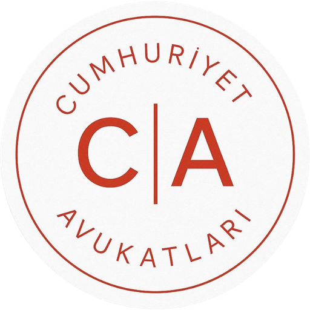

<p align="center">
  
</p>

<h1 align="center">Marka &amp; Patent Çalışma Kartları</h1>

<p align="center">
  Marka ve Patent Vekilliği Sınavı'na hazırlananlar için <strong>%100 tarayıcıda çalışan</strong>,
  ücretsiz ve açık kaynak <strong>1194 soru–cevap kartı</strong>.<br>
  Üyelik yok, çerez yok, veri toplanmaz.
</p>

<p align="center">
  <strong>Canlı site:</strong> <a href="https://ersancetin.github.io/marka-patent-calisma-kartlari/">ersancetin.github.io/marka-patent-calisma-kartlari</a>
</p>

---

## Nedir?

Sınai mülkiyet mevzuatını **aktif hatırlama** yöntemiyle tekrar etmek için hazırlanmış çevrilebilir
soru–cevap kartlarıdır. Kartın ön yüzünde soru, arka yüzünde cevap ve varsa mevzuat dayanağı yer alır.

Arayüz bilerek sade tutulmuştur: siteyi açan kişi tanıtım metni okumadan doğrudan konu seçip
çalışmaya başlar. Cumhuriyet Avukatları'nın
[PDF Araçları](https://ersancetin.github.io/cumhuriyet-avukatlari/) projesiyle aynı marka kimliğini
ve aynı ilkeyi paylaşır: **her şey kullanıcının tarayıcısında çalışır.**

## Özellikler

| Özellik | Açıklama |
|---|---|
| Çoklu konu seçimi | Birden çok konuyu tek turda birleştirerek çalışma |
| Alt konu rozeti | Her kart, taksonomideki alt konu koduyla etiketli |
| Kart çevirme | Tıklama, `Boşluk` tuşu veya dokunmatik |
| Bildim / Tekrar Et | Kart işaretleme; tur sonunda yalnızca bilemediklerini tekrar etme |
| Kalıcı ilerleme | İşaretler `localStorage`'da tutulur, sonraki oturumda korunur |
| Karışık / sıralı mod | Sırayı bozarak ezber etkisini kırma |
| Ters yön | "Cevap → Soru" yönüyle tanımdan kuruma gitme |
| Klavye ve kaydırma | `←` `→` `1` `2` `S` `Esc`, mobilde sağa–sola kaydırma |
| Tur özeti | Bilme oranı ve tekrar seçenekleri |

## Konular

İçerik, **Marka & Patent Vekilliği Sınavı konu taksonomisine** göre düzenlenmiştir:
`Modül (A–E) → Konu (A1, D3, E1 …) → Kart (alt konu kodlu)`

Toplam **1194 kart**, **5 modül**, **35 konu**.

### Modül A — Genel Hukuk (328 kart)

| Konu | Kart |
|---|---|
| **A1** Türk Ticaret Kanunu | 208 |
| **A2** Türk Medeni Kanunu | 68 |
| **A3** Türk Borçlar Kanunu | 52 |

### Modül B — Kurum ve Uluslararası Çerçeve (86 kart)

| Konu | Kart |
|---|---|
| **B1** TÜRKPATENT | 22 |
| **B2** Vekillik Mevzuatı | 26 |
| **B3** Uluslararası Anlaşmalar | 38 |

### Modül C — Tasarım Hukuku (127 kart)

| Konu | Kart |
|---|---|
| **C1** Temel Kavramlar | 20 |
| **C2** Koruma Şartları | 28 |
| **C3** Başvuru ve Tescil Süreci | 29 |
| **C4** Süreler ve Hak Kaybı | 15 |
| **C5** Hak Sahipliği ve İhlal | 23 |
| **C6** Lahey Sistemi | 12 |

### Modül D — Marka Hukuku (348 kart)

| Konu | Kart |
|---|---|
| **D1** Marka Kavramı ve Türleri | 29 |
| **D2** Başvuru Süreçleri ve Şekli Şartlar | 30 |
| **D3** Mutlak Ret Nedenleri (m.5) | 43 |
| **D4** Nispi Ret Nedenleri (m.6) | 48 |
| **D5** İtiraz ve İnceleme Süreçleri | 24 |
| **D6** Tescil Sonrası İşlemler | 25 |
| **D7** Marka Hakkının Kapsamı ve Sınırları | 21 |
| **D8** Markanın Kullanılması ve İptal | 26 |
| **D9** Hükümsüzlük ve Sona Erme | 22 |
| **D10** Marka Hakkına Tecavüz | 25 |
| **D11** Madrid Protokolü | 24 |
| **D12** Coğrafi İşaret ve Geleneksel Ürün Adı | 31 |

### Modül E — Patent Hukuku (305 kart)

| Konu | Kart |
|---|---|
| **E1** Patentlenebilirlik Kriterleri | 47 |
| **E2** Araştırma Raporu ve Doküman Kategorileri | 22 |
| **E3** Başvuru, Şekli Şartlar ve Belgeler | 39 |
| **E4** İnceleme ve Belgelendirme | 21 |
| **E5** Faydalı Model | 22 |
| **E6** Ücretler ve Hakların Yeniden Tesisi | 26 |
| **E7** Uluslararası Başvurular (PCT, EPC) | 26 |
| **E8** Hak Sahipliği ve Çalışan Buluşları | 33 |
| **E9** Tecavüz ve Hükümsüzlük | 30 |
| **E10** Lisans ve Zorunlu Lisans | 25 |
| **E11** Entegre Devre Topoğrafyaları | 14 |

> **Not:** Kartlar bir çalışma aracıdır; hukuki görüş veya güncel mevzuat metni yerine
> geçmez. Mevzuat değişebilir — atıfları güncel metinden doğrulayınız.

## Veri güvenliği ve KVKK

- Site **kişisel veri toplamaz**; çerez, analitik ve izleme kodu içermez.
- "Bildim / Tekrar Et" işaretleri yalnızca tarayıcının yerel deposunda (`mpck.ilerleme.v1`) tutulur,
  hiçbir sunucuya gönderilmez ve "İlerlemeyi sıfırla" ile silinebilir.
- İddia doğrulanabilir: geliştirici araçlarının "Ağ" sekmesinde, site dosyaları dışında hiçbir
  isteğin gitmediği görülebilir.
- Ayrıntılar: [Gizlilik & KVKK Bildirimi](gizlilik.html)

## Teknik yapı

Derleme adımı olmayan statik bir sitedir (HTML + CSS + vanilla JS). Çalışma anında hiçbir CDN'e
veya dış kaynağa bağlanılmaz; ikonlar satır içi SVG'dir.

```
index.html             — konu seçimi, kart ekranı, tur özeti (tek sayfa)
katki.html             — kart ekleme rehberi
gizlilik.html          — gizlilik & KVKK bildirimi
data/desteler.js       — KART İÇERİĞİ (modül → konu → kart; düzenlenecek tek dosya)
assets/css/style.css   — marka katmanı (ince başlık/altbilgi, doküman sayfası)
assets/css/kartlar.css — kart arayüzü
assets/js/kartlar.js   — kart motoru
```

### Yerelde çalıştırma

```bash
python3 -m http.server 8000
# http://localhost:8000
```

### Yayın

Depo, `.github/workflows/deploy.yml` üzerinden GitHub Pages'e otomatik yayınlanır.

## Sorumluluk

Kartlar bir **çalışma aracıdır**; hukuki görüş, danışmanlık veya güncel mevzuat metni yerine geçmez.
Mevzuat değişebilir; karar verirken daima güncel metne ve içtihada başvurunuz.

## Katkı

Kart önerileri, düzeltmeler ve hata bildirimleri için
[Issues](https://github.com/ersancetin/marka-patent-calisma-kartlari/issues) sayfasını
kullanabilirsiniz.

## Lisans

[MIT](LICENSE) — Cumhuriyet Avukatları tarafından meslektaş dayanışması için geliştirilmiştir.
